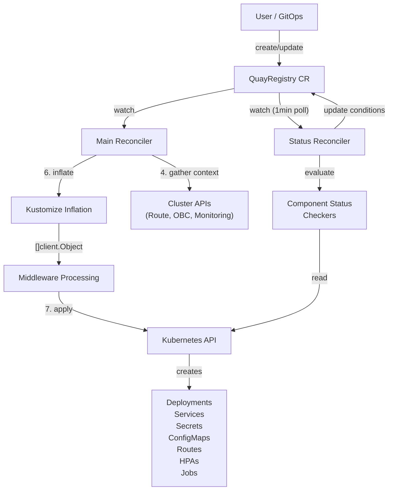
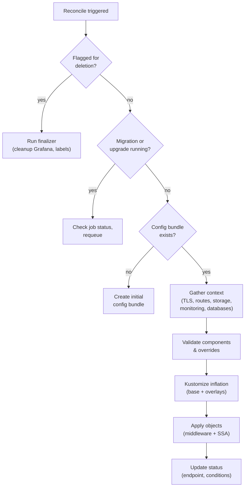
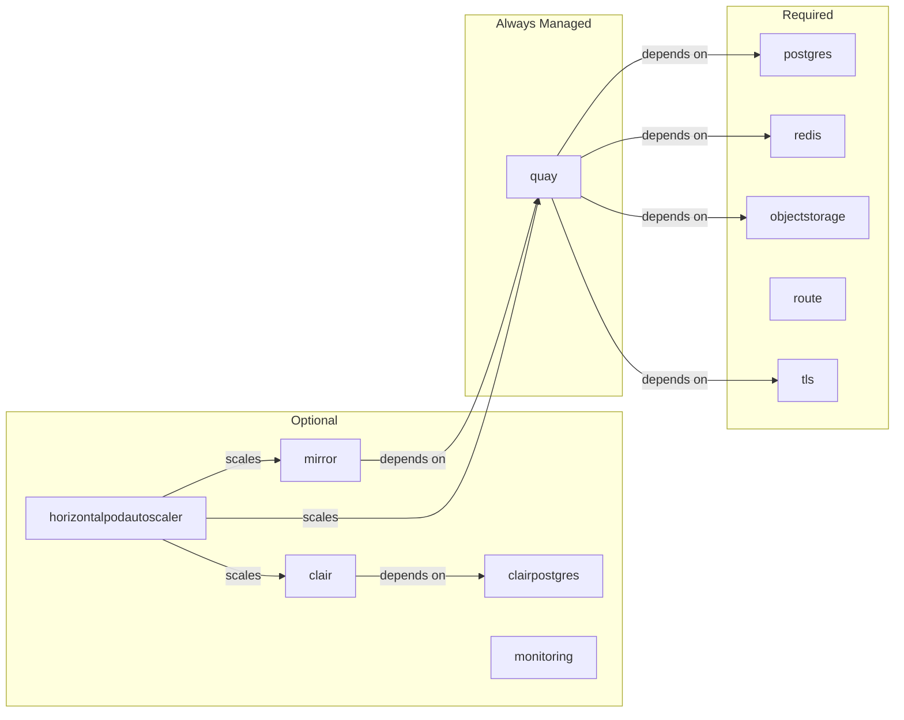
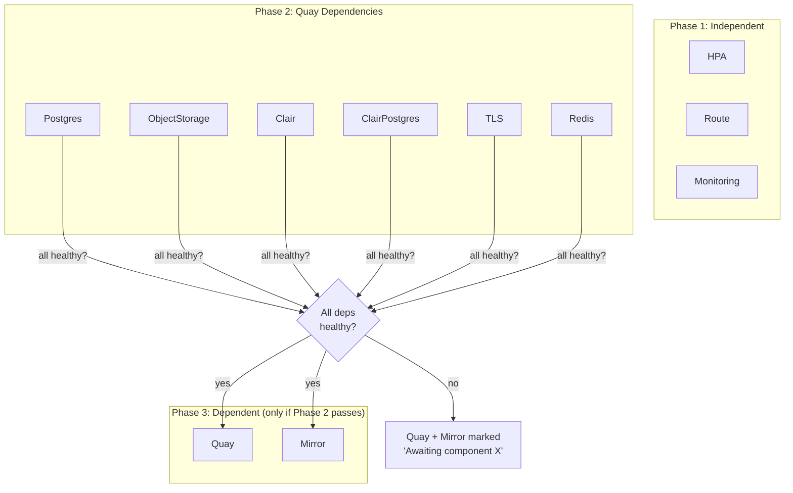

# Architecture

The quay-operator is a Kubernetes operator that deploys and manages [Quay container registry](https://github.com/quay/quay) instances. It watches `QuayRegistry` custom resources and reconciles them into the full set of Kubernetes objects needed to run Quay and its dependencies.

## System Overview

## Reconciliation Flow

The main reconciler processes each `QuayRegistry` through an 8-step sequence. Each step can short-circuit with a requeue or error condition.

## Component Architecture

The operator manages 11 component types. Each can be independently managed or unmanaged.

## Status Evaluation

Component health is evaluated in dependency order. If any Quay dependency is unhealthy, Quay and Mirror are marked as not ready without being checked.

## Key Design Decisions

**Two reconcilers instead of one.** The main reconciler runs database migrations when the Quay version changes. If status evaluation shared the same requeue loop, migrations would re-run on every 1-minute tick. Separating them allows frequent status polling without expensive side effects.

**Kustomize for manifest generation.** Component manifests are stored as standard Kustomize overlays rather than Go templates. This makes the manifests readable, testable with standard tools, and allows operators to inspect what will be applied before the operator transforms it.

**Server-side apply with ForceOwnership.** The operator is the sole owner of managed resource fields. This is intentional — it prevents configuration drift where manual patches to managed resources survive across reconciles. Users customize via the `QuayRegistry` spec (overrides, config bundle), not by patching managed resources directly.

**Middleware for what Kustomize can't do.** Some transforms (injecting user-specified env vars, applying resource overrides, stripping resource requests for dev mode) require Go logic that Kustomize's patch system cannot express. The middleware layer runs after inflation and before cluster apply.
